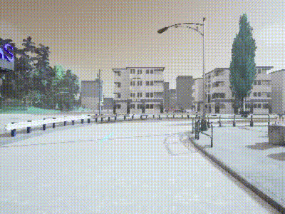
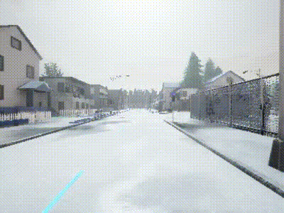

# Neural Network Image Based Driving

## About
This repository trains a model on various maps in the CARLA simulator to return steering controls given an image. The model can then be used for diverse data collection to collect trajectories where the car stays in its lane, commits a line violation, or collides with objects depending on the weather condition. 

https://github.com/user-attachments/assets/eab35d29-fe0e-4749-b411-324592de2abf

## How To Use
You will need the following pre requirements:

Ubuntu 20.04,
CARLA 9.14

1. Install the Conda Environment
<pre>conda env create -f environment.yml
conda activate myenv
</pre>

2. We will need to collect data from CARLA for the training process.
<pre>python collect_data.py
</pre>

3. Train the model (An NVIDIA V100 was used to train the model)
<pre>python train.py
</pre>

4. Test the model
<pre>python inference.py
</pre>

## Results
Here are some video examples to show the model's capabilities. 

